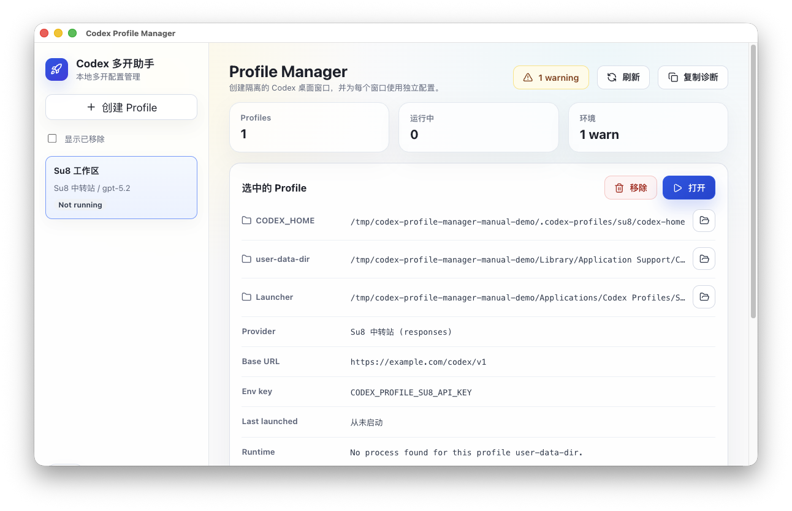
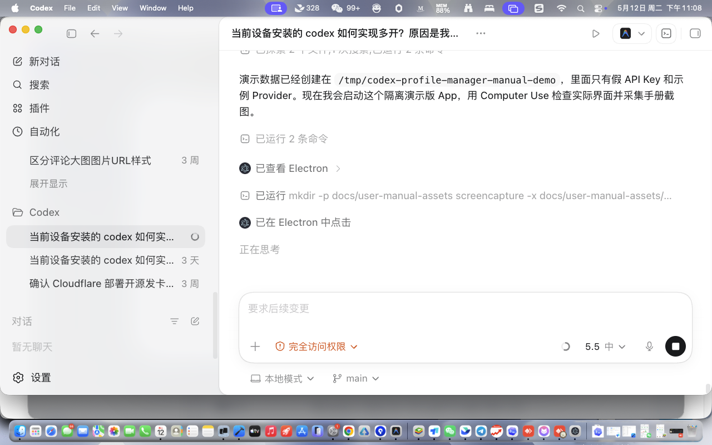
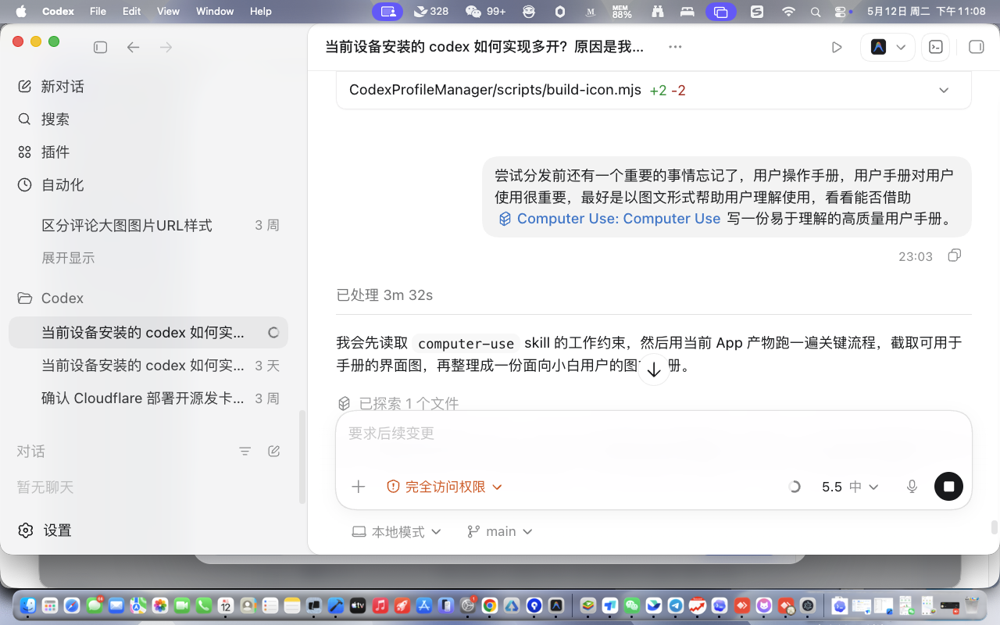
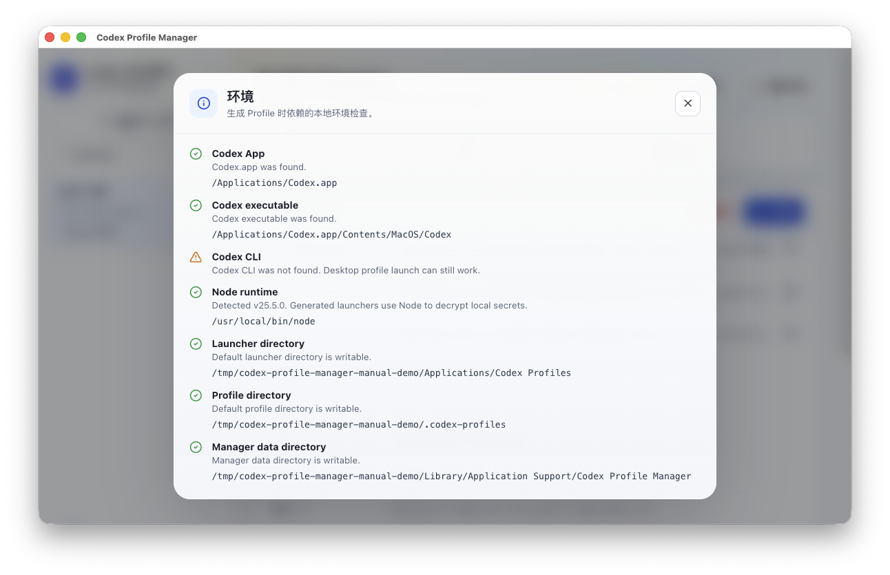

# Codex 多开助手用户手册

Codex 多开助手用于创建多个相互隔离的 Codex 桌面窗口。每个窗口都可以拥有独立的工作区、配置文件、API Key、Base URL 和模型。

适合这些场景：

- 一个 Codex 窗口不够用，需要同时开启多个窗口处理不同项目。
- 希望一个窗口使用官方 OpenAI API Key，另一个窗口使用第三方 Responses 兼容接口。
- 不想手动修改 `config.toml`、启动脚本或命令行参数。

## 1. 安装与打开

1. 解压 `Codex 多开助手-版本号-arm64-mac.zip`。
2. 将 `Codex 多开助手.app` 拖到 `Applications`，或直接双击打开。
3. 如果 macOS 提示无法打开，说明这是未签名测试版。可以在终端执行：

```bash
xattr -dr com.apple.quarantine "/Applications/Codex 多开助手.app"
```

4. 再次双击打开 App。

注意：当前测试版主要面向 macOS Apple Silicon。正式公开分发前需要签名和 notarization。

## 2. 主界面说明



左侧是 Profile 列表。一个 Profile 就是一套独立 Codex 工作区配置。

右侧是当前选中 Profile 的详细信息：

- `CODEX_HOME`：该 Codex 窗口使用的配置目录。
- `user-data-dir`：该 Codex 桌面窗口自己的应用数据目录。
- `Launcher`：生成的双击启动器 App。
- `Provider`：当前使用的 API 服务商。
- `Base URL`：第三方接口地址。
- `Env key`：启动器内部使用的环境变量名。

常用按钮：

- `创建 Profile`：开始创建一个新的多开窗口。
- `打开`：启动当前选中的 Codex 窗口。
- `移除`：从列表隐藏 Profile，文件会保留。
- `刷新`：重新检查运行状态。
- `复制诊断`：复制不包含 API Key 的诊断信息，方便反馈问题。

## 3. 创建新的 Codex 多开窗口

点击左侧 `创建 Profile` 后，会打开创建向导。



第一步需要填写：

- `Profile 名称`：建议使用容易识别的名字，例如 `Su8 工作区`、`官方账号`、`项目 A`。
- `继承默认 Codex 配置`：建议保持开启。这样会尽量保留你已有的插件、MCP 服务、可信项目和功能开关。

填写后点击 `下一步`。

## 4. 配置 Provider



Provider 是 Codex 请求模型时使用的服务配置。

如果使用第三方中转站，按下面填写：

- `Provider 类型`：选择 `第三方 Responses 兼容接口`。
- `Provider 名称`：填写便于识别的名称，例如 `Su8`、`公司代理`。
- `Base URL`：填写第三方提供的 OpenAI 兼容地址，通常以 `/v1` 结尾。
- `模型`：填写模型 ID，例如 `gpt-5.2`。如果服务商支持 `/models`，可以点击 `获取模型` 后从列表中选择。
- `API Key`：填写第三方服务商提供的 API Key。

如果使用官方 OpenAI API Key：

- `Provider 类型` 选择 `官方 OpenAI API Key`。
- 填写模型和 API Key 即可。

API Key 会保存在本地加密文件中，不会写入 `config.toml`，也不会出现在诊断报告中。

## 5. 测试 Provider

进入 `测试` 步骤后，点击 `测试 Provider`。

测试会检查：

- Base URL 是否可访问。
- API Key 是否能通过认证。
- Provider 是否支持 Responses API。

如果测试失败，仍然可以继续生成 Profile，但生成后的 Codex 窗口可能无法正常对话。建议先根据错误信息修正 Base URL、API Key 或模型名称。

## 6. 选择启动器位置

进入 `启动器` 步骤后，可以选择生成的 `.app` 启动器保存位置。

默认位置：

```text
~/Applications/Codex Profiles/
```

如果你不确定放在哪里，保持默认即可。创建完成后，可以在 Finder 中双击这个启动器打开对应的 Codex 窗口。

## 7. 生成并打开

最后一步确认信息后点击 `生成`。

生成完成后，回到主界面：

1. 在左侧选择刚创建的 Profile。
2. 点击右上角 `打开`。
3. Codex 会直接进入对应的 API Key 和 Base URL 配置，不需要再走官方登录页。

如果启动成功，主界面的运行状态会在刷新后更新。

## 8. 修改已有 Provider

在主界面下方可以编辑当前 Profile 的 Provider：

- 修改 `Provider 名称`、`Base URL` 或 `模型`。
- 如果不想更换 API Key，`新的 API Key` 保持空白。
- 点击 `测试` 可以复用已保存的 API Key 进行测试。
- 点击 `保存 Provider` 会同步更新 Profile 的 `config.toml` 和启动器。

每次保存前，App 会自动创建配置备份。你可以在 `最近配置备份` 中恢复旧配置。

## 9. 查看环境检查

点击顶部环境状态按钮，例如 `1 warning`，可以查看本机环境。



常见状态说明：

- `Codex App`：是否找到 `/Applications/Codex.app`。
- `Codex executable`：是否找到 Codex 桌面应用的可执行文件。
- `Codex CLI`：找不到通常不影响桌面多开。
- `Node runtime`：生成的启动器需要 Node 来解密本地 API Key。
- `Launcher directory`：启动器目录是否可写。
- `Profile directory`：Profile 配置目录是否可写。
- `Manager data directory`：本 App 自己的数据目录是否可写。

如果只有 `Codex CLI` 是 warning，一般可以继续使用桌面多开功能。

## 10. 移除、恢复和彻底删除

`移除` 只是把 Profile 从常用列表里隐藏，配置文件和启动器仍保留。

如需查看已移除的 Profile：

1. 勾选左侧 `显示已移除`。
2. 选择已移除的 Profile。
3. 可以点击 `恢复` 重新启用。

如果确认不再需要，可以点击 `彻底删除`。这会删除：

- 该 Profile 的 `CODEX_HOME`。
- 该 Profile 的 `user-data-dir`。
- 生成的启动器 App。
- 本地加密保存的 API Key。

彻底删除无法恢复，请谨慎操作。

## 11. 常见问题

### 打开生成的 Codex 后还是进入登录页

通常说明 Profile 配置或 `auth.json` 没有正确生成。请回到 Codex 多开助手，选择该 Profile，点击 `保存 Provider` 后再点击 `打开`。

### 对话请求走了官方 Base URL

请检查当前 Profile 的 `Provider` 和 `Base URL` 是否正确。修改后点击 `保存 Provider`，再重新打开该 Profile。

### 获取模型失败

部分第三方服务商不提供 `/models`，或者返回格式不兼容。此时可以继续手动填写模型 ID。

### 能否接入智谱、通义、DeepSeek、Kimi 等服务商

可以先按“第三方 Responses 兼容接口”尝试，但前提是服务商提供 OpenAI/Responses 兼容入口。只支持原生 API 或只支持 Chat Completions 的服务商，不一定能在当前 MVP 中正常使用。

建议检查：

- Base URL 是否是 OpenAI 兼容地址，并且通常以 `/v1` 结尾。
- API Key 是否支持该兼容接口。
- 模型 ID 是否是接口实际接受的 ID，而不是网页上展示的模型名称。
- `测试 Provider` 是否通过 Responses 测试。

### 测试 Provider 报 401 或 403

通常是 API Key 不正确、额度不足，或服务商要求使用不同的 Key 格式。请在服务商后台确认 Key 可用。

### macOS 提示 App 已损坏或无法打开

当前测试版未签名，可能被 Gatekeeper 阻止。试用阶段可以执行：

```bash
xattr -dr com.apple.quarantine "/Applications/Codex 多开助手.app"
```

正式分发版本需要签名和 notarization。

## 12. 安全说明

- API Key 只保存在本机。
- API Key 使用本地加密文件保存。
- 诊断报告不会包含 API Key。
- `config.toml` 和启动器脚本不会写入明文 API Key。
- 如果要把问题反馈给开发者，优先使用 `复制诊断`，不要直接发送自己的 API Key。
