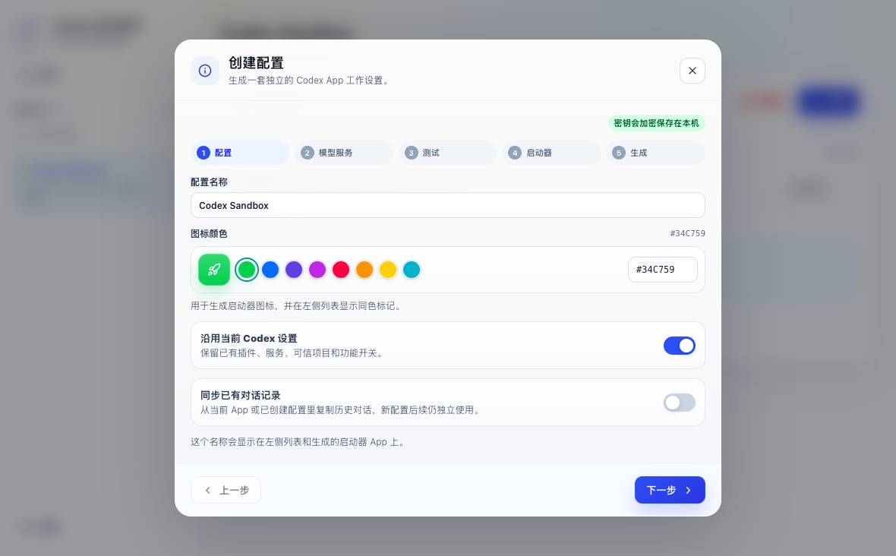
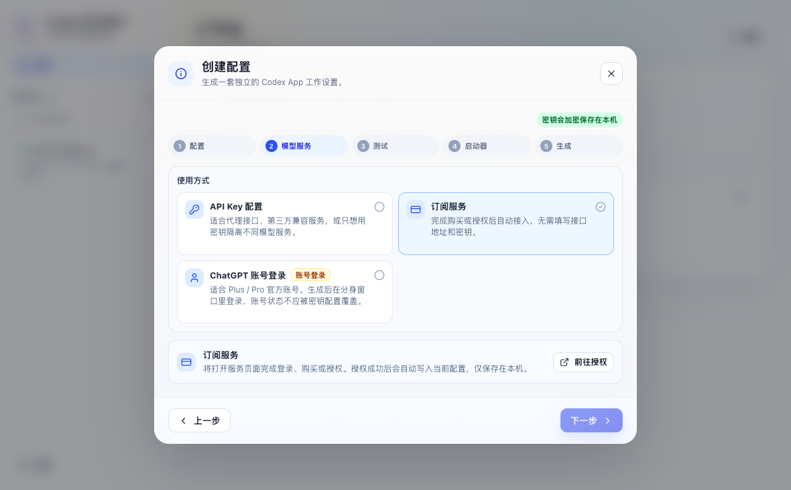
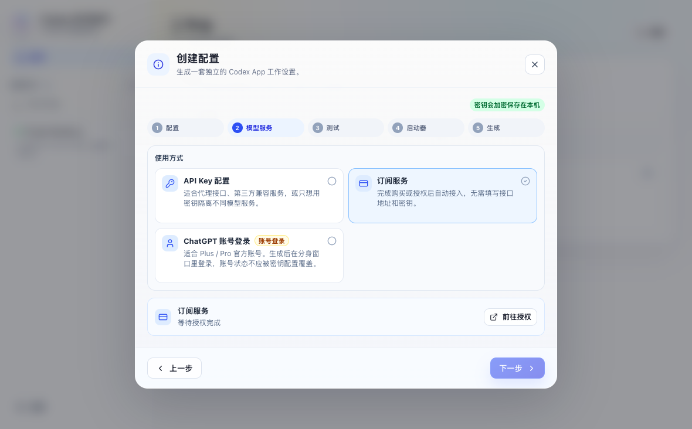
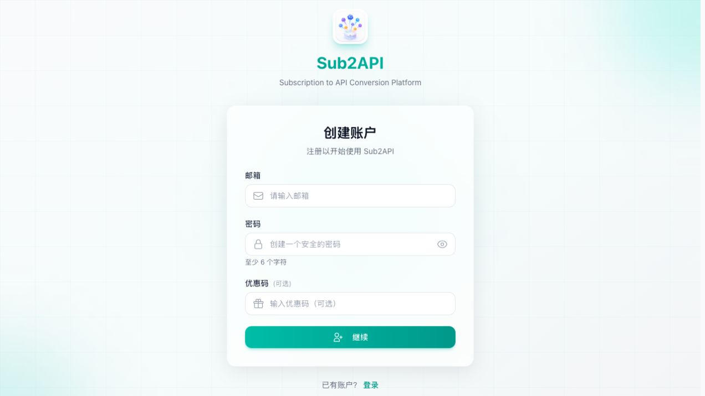
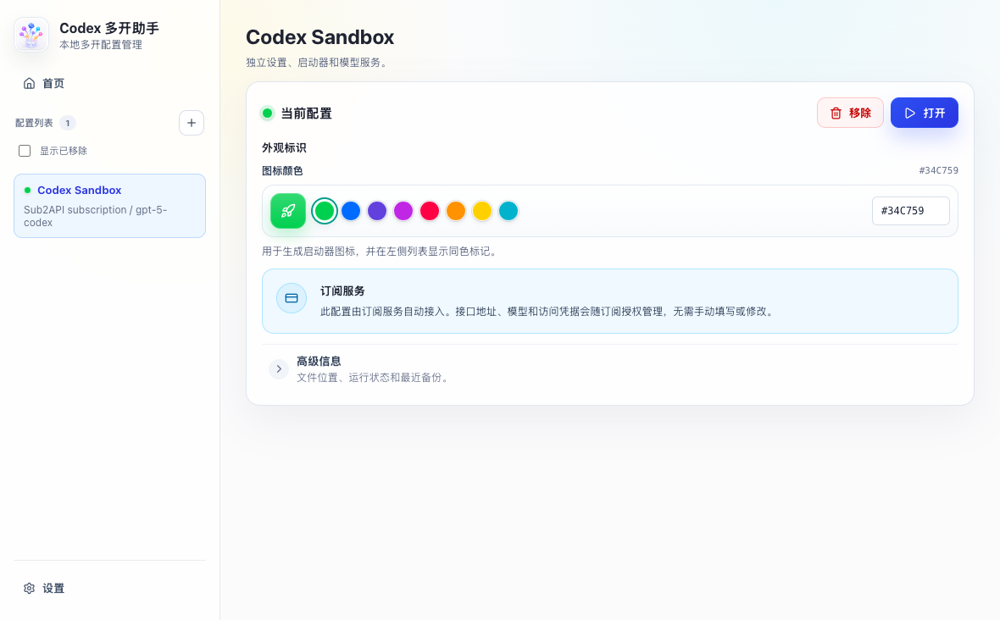

# Codex 多开助手订阅服务使用指南

订阅服务适合不想自己寻找 API Key、填写接口地址或维护中转配置的用户。完成一次注册、购买和授权后，Codex 多开助手会自动创建可用配置；访问凭据只保存在当前设备，不会显示在网页或写入启动脚本。

> 支持 macOS 和 Windows。使用前请先安装最新版 Codex / ChatGPT 桌面 App，并将 Codex 多开助手更新到包含“订阅服务”的版本。

## 整个过程需要多久

已有账号和有效订阅时通常不到 1 分钟。新用户需要完成邮箱验证和支付，通常为 2–5 分钟。

```text
创建配置 → 选择订阅服务 → 注册或登录 → 选择套餐并支付
        → 自动返回授权页 → App 显示授权完成 → 生成并打开 Profile
```

## 1. 创建一个新配置

打开 Codex 多开助手，点击左侧配置列表旁的 `+`。填写容易识别的名称，例如“工作订阅”或“项目 A”。图标颜色只用于区分配置，可按喜好选择。



- `沿用当前 Codex 设置`：建议保持开启，可继承已有插件、服务和可信项目。
- `同步已有对话记录`：按需开启。它只复制你选择的历史对话，不会让不同 Profile 后续继续共用数据。

完成后点击 `下一步`。

## 2. 选择“订阅服务”

在“使用方式”中选择 `订阅服务`。此模式不需要填写 Base URL、模型或 API Key。



点击 `前往授权`。App 会进入等待状态，并在浏览器中打开安全授权页面。



> 请保持 Codex 多开助手运行。授权页面有效期为 30 分钟；超时后回到 App 重新点击“前往授权”即可。

## 3. 注册或登录

第一次使用时选择注册，填写邮箱和密码。验证码会发送到你的邮箱；完成邮箱验证后会自动继续原来的购买流程，不需要重新从 App 开始。



已有账号时直接登录。系统会自动判断订阅状态：

- 已有有效订阅：直接继续当前设备授权，不会要求重复购买。
- 有多个有效订阅：授权页会列出套餐名称和到期时间，请选择当前 Profile 要使用的套餐。
- 没有有效订阅：自动进入套餐购买页面。

## 4. 选择套餐并完成支付

在购买页选择适合自己使用强度的套餐，以页面实时显示的价格、额度和有效期为准。支付渠道目前包括：

- `支付宝`：人民币结算。
- `微信支付`：人民币结算。
- `国际银行卡`：美元结算，支持页面显示的银行卡及 Link 等方式。

支付完成后不要手动返回 Dashboard。页面会自动确认订单、恢复原授权会话并返回 Codex 多开助手。一般几秒内完成；如果支付平台回调较慢，保持页面和 App 打开，系统会继续查询订单状态。

> 只有服务端确认支付成功后才会开通订阅。浏览器跳转本身不会被当作支付成功，因此刷新页面或重复回调不会重复发放额度。

## 5. 生成并打开 Profile

App 显示 `授权已完成` 后，继续完成向导并点击 `生成`。生成后的配置会标记为“订阅服务”，接口地址、模型和访问凭据由授权服务管理，不能在 App 中误改。



选择左侧 Profile，点击 `打开` 即可开始使用。以后无需重复购买或填写密钥；只要订阅仍有效，该 Profile 可以继续打开。

## 订阅、额度与设备

- 套餐额度按页面显示的日、周、月限制计算，达到任一限制后需等待对应周期恢复或升级套餐。
- `RPM` 表示每分钟最多请求次数，不等于同时打开窗口的数量。Codex 一次任务可能连续发出多次请求。
- 每台完成授权的设备都会获得独立设备凭据，但共同受当前账号订阅额度约束。
- 订阅到期、退款或设备授权被撤销后，对应 Profile 将不能继续请求服务。
- 同一套餐续期后，原 Profile 和设备凭据会自动继续使用，无需重新创建 Profile 或替换 API Key。
- 更换到不同套餐时，在该 Profile 的详情页点击 `重新授权订阅`，登录并选择新套餐即可。App 会原地更新授权，不会删除 Profile、项目或历史对话。

## 常见问题

### 点击“前往授权”后没有打开网页

先确认网络可以访问 `https://sub2api.minai.eu.org`，然后关闭系统代理或安全软件的拦截重试。仍无法打开时，在 GitHub Issue 中提供 App 版本、系统版本和复制的诊断信息，请勿粘贴密码或任何 API Key。

### 已付款，但页面长时间显示处理中

请先等待 1–2 分钟，不要重复付款。系统会通过支付回调和主动查单两种方式恢复订单。超过 5 分钟仍未完成时，请将注册邮箱、订单号和支付时间发送到 `jqy.tieniu@gmail.com`；不要公开银行卡、支付宝或微信支付凭据。

### 支付成功后没有回到 App

保留支付成功页面，切回 Codex 多开助手查看是否已经显示“授权已完成”。如果仍在等待，回到浏览器原授权页刷新一次；授权过期则在 App 中重新发起，已生效的订阅不会要求再次付款。

### 打开 Profile 后提示额度不足或请求过快

额度不足表示日/周/月额度之一已用完；“请求过快”通常表示达到 RPM 限制。等待限制恢复，或在订阅中心查看当前用量和套餐。

### 套餐续期或更换后需要重新创建 Profile 吗

不需要。同一套餐续期后原 Profile 会自动继续使用。如果改买了其他套餐，打开原 Profile 的详情页，点击 `重新授权订阅` 并选择新套餐；授权完成后继续使用原 Profile，已有项目和历史对话都不会变化。

### 更换电脑后可以继续使用吗

可以。在新电脑安装最新版 App，使用相同账号重新走一次“前往授权”。新设备会获得独立凭据，但会和旧设备共同使用账号订阅额度。如需停用旧设备，可在服务中心的 API 密钥页面禁用名称以 `Codex Multi Launcher` 开头的对应设备密钥。

## 安全与隐私

- 桌面端拿不到 Sub2API 管理员凭据、上游主 Key 或支付密钥。
- 设备访问凭据通过一次性 PKCE 授权兑换，并加密保存在本机。
- 授权码只能兑换一次，过期后自动失效。
- App 诊断信息和启动脚本不包含明文访问凭据。
- 支付由对应支付平台处理，Codex 多开助手不保存银行卡、支付宝或微信支付信息。

技术问题请前往 [GitHub Issues](https://github.com/JqyModi/codex-multi-launcher/issues)。支付、退款或包含个人资料的问题请发送到 `jqy.tieniu@gmail.com`，不要在公开 Issue 中附订单号或付款凭证。

购买前请阅读：[服务条款](https://sub2api.minai.eu.org/legal/terms)、[隐私政策](https://sub2api.minai.eu.org/legal/privacy-policy)和[退款规则](https://sub2api.minai.eu.org/legal/refund-policy)。
